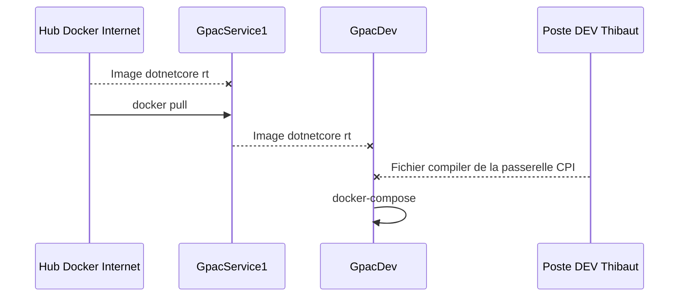

# Mise en docker des modules GPAC

Suivant l'architecture suivante...

# Serveur GpacService1 [...]
> Version : Debian
> Localisation : ESXi
> Sauvegardes : 
## Services
>wikijs (docker wikijs-?? et wikijs-db) 
>Hub Docker interne

# Serveur GpacDev [...]
Présentation
> Version : Red Hat Entreprise Linux 7.5
> Localisation : Machine virtuel Hyper-V sur poste de développement Dell Txxxx
> Sauvegardes : Veeam ?

## Services
>CPI V17
>MySQL V??
>
# Utilisation d'un docker

